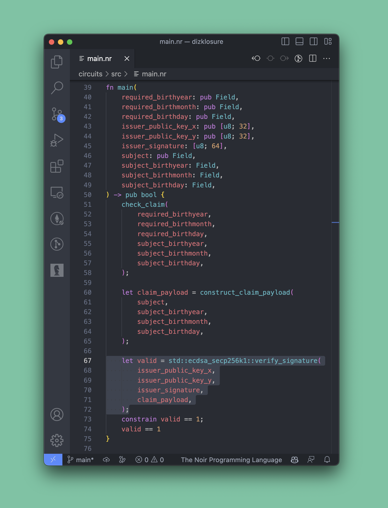

<!-- demo slides for hackathon presentation -->
<!-- demo slides for hackathon presentation -->
<!-- demo slides for hackathon presentation -->
<!-- demo slides for hackathon presentation -->
<!-- demo slides for hackathon presentation -->

# dizkclosure

primitive zk credentialing

w/ selective disclosure


---

# overview

📜 orgs make claims about users

🤐 claims may contain sensitive/private info

🎭 users selectively disclose attributes of those claims

💻🔐 or prove some computation over the secret inputs

---

### background, boring jargon 

aztec is a zk rollup (in development):
* hybrid chain w/ public & private state
* selectively private contracts, largely unexplored until recently
* noir is the high-level language, compling to a sort of "bytecode"
* PLONK, Honk, TurboPlonk, GoblinPlonk, UltraPLONK, are different flavors of "zk backends" that noir can compile  to

**since aztec is still pre-launch, noir is just used to augment traditional solidity contracts**

---

# demo: age verification 👵🏼 👶🏽

gov signs `h(alice, 2003, 01, 02)`, attesting to her birthday (offchain)

bob runs a contract requiring users to be 21+

alice wants to use the contract:
1) without revealing her exact birthday
2) without showing bob the signature

---

alice provides a proof that:
* she has a sig from the gov, attesting to her birthday
* that signature is valid
* the claimed birthday is before today, 21 years ago

*all while revealing neither the claimed date, nor the actual signature claiming that date*



---

alice (*prover*) runs the circuit to generate a proof (*in reality, a button*)

the `pub` inputs are cleartext -- others, hidden from verifiers


``` rust
fn main(
    required_birthyear: pub Field,
    required_birthmonth: pub Field,
    required_birthday: pub Field,
    issuer_public_key_x: pub [u8; 32],
    issuer_public_key_y: pub [u8; 32],
    issuer_signature: [u8; 64],
    subject: pub Field,
    subject_birthyear: Field,
    subject_birthmonth: Field,
    subject_birthday: Field,
) -> pub bool {
```

---

### proof verification

bob needs a way for his contract to process the proofs

```
➜  circuits git:(main) nargo codegen-verifier
Contract successfully created and located at /Users/sam/dev/noir/nplate/circuits/contract/plonk_vk.sol
```

yields... pure black magic 🧙‍♂️ that we don't need to grok :)

``` solidity
pragma solidity >=0.8.4;

library UltraVerificationKey {
    function verificationKeyHash() internal pure returns(bytes32) {
        return 0x4eb2ea01fc3b5271643f56a58dd532c72a3e0003f2a5272fc5bbc9b0a2438a9e;
    }

    function loadVerificationKey(uint256 _vk, uint256 _omegaInverseLoc) internal pure {
        assembly {
            mstore(add(_vk, 0x00), 0x0000000000000000000000000000000000000000000000000000000000008000) // vk.circuit_size
            mstore(add(_vk, 0x20), 0x0000000000000000000000000000000000000000000000000000000000000006) // vk.num_inputs
            mstore(add(_vk, 0x40), 0x2d1ba66f5941dc91017171fa69ec2bd0022a2a2d4115a009a93458fd4e26ecfb) // vk.work_root
```

---

### the plonk verifier

neutral 3rd party infra that verifies a specific, known circuit.


generated from any circuit, deploys to any evm chain,

and usable from any contract or offchain RPC.

---

### future steps

* infrastructure to store claims & scalably generate proofs
* user-defined credential types & relationships
* more flexible control over disclosures
* claims defined as Soul Bound 721s for easy discovery & interop with ecosystem tooling
* ... ?

---

### takeaway

key building block here is *"prove you have a signature for this action, without giving me that signature"*

since nfts are exchanged through signed intents,

might be useful more broadly :)

---

### thx! ✌️
